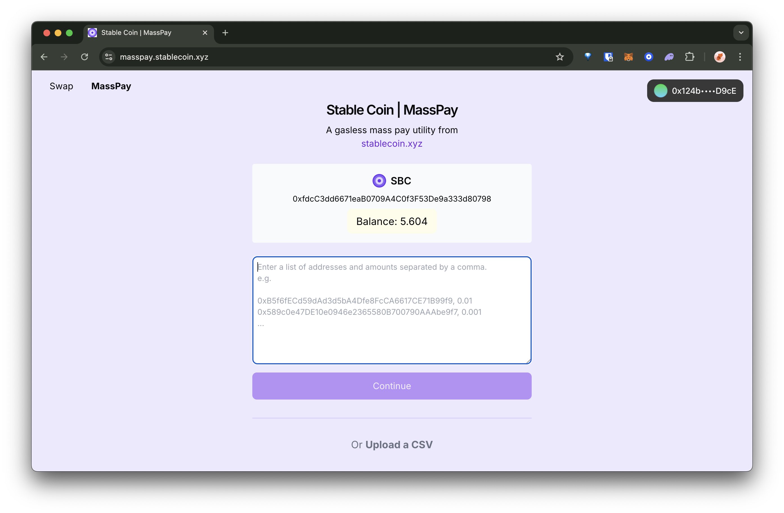

# masspay-example

This repo contains a utility allowing users to airdrop an ERC20 token (e.g. SBC) on the Base blockchain without having to pay for gas fees. It uses the [Pimlico](https://pimlico.io/) Paymaster and Account Abstraction SDK to send user operations and [WalletConnect](https://reown.com/) to connect to the user's wallet. The [ShadCN UI](https://ui.shadcn.com/) component library is used for buttons, dialogs, tables, and toasts.

## Demo

You can interact with a live demo of the project [here](https://masspay.stablecoin.xyz/). You would need to have the SBC token and be on the Base blockchain.

[](https://masspay.stablecoin.xyz/)

You can first swap for SBC on Base using the [Gasless Swap](https://swap.stablecoin.xyz/) tool, which uses Uniswap V3 behind the scenes. The code for the Gasless Swap can be found [here](https://github.com/stablecoinxyz/gasless-swap/).

The SBC token is a multi-chain stablecoin pegged to the USD via Brale. The code for the SBC token can be found [here](https://sepolia.basescan.org/token/0xf9FB20B8E097904f0aB7d12e9DbeE88f2dcd0F16#code).

Once you have a SBC balance in your wallet, connect your wallet (top right corner). You can then input the recipient addresses and amounts to airdrop via `Copy and Paste Mode` or `CSV Mode`. Each line is to follow the format `address,amount`. You can airdrop different amounts for different addresses if you wish.

You can use a [pre-generated csv file](./src/csv-samples/airdrop.100.csv) or use a tool like [Ethereum Wallet Generator](https://github.com/Planxnx/ethereum-wallet-generator) to generate a list of addresses.

Currently, the project is set up to airdrop SBC tokens to 200 addresses at a time.

## Environment Variables

To run this project, you will need to add the following environment variables to your .env file:

- `NEXT_PUBLIC_PIMLICO_API_KEY` - get your API key from the [Pimlico dashboard](https://dashboard.pimlico.io/)
- `NEXT_PUBLIC_SPONSORSHIP_POLICY_ID` - create a policy from the [Pimlico dashboard](https://dashboard.pimlico.io/) and get its ID
- `NEXT_PUBLIC_WALLETCONNECT_PROJECT_ID` - create a project and get its ID from the [WalletConnect dashboard](https://cloud.reown.com/)

## Run locally

Install dependencies

```bash
npm install
```

Start development server after setting up the environment variables

```bash
npm run dev
```

## Author

- [@Ectsang](https://www.github.com/Ectsang)
