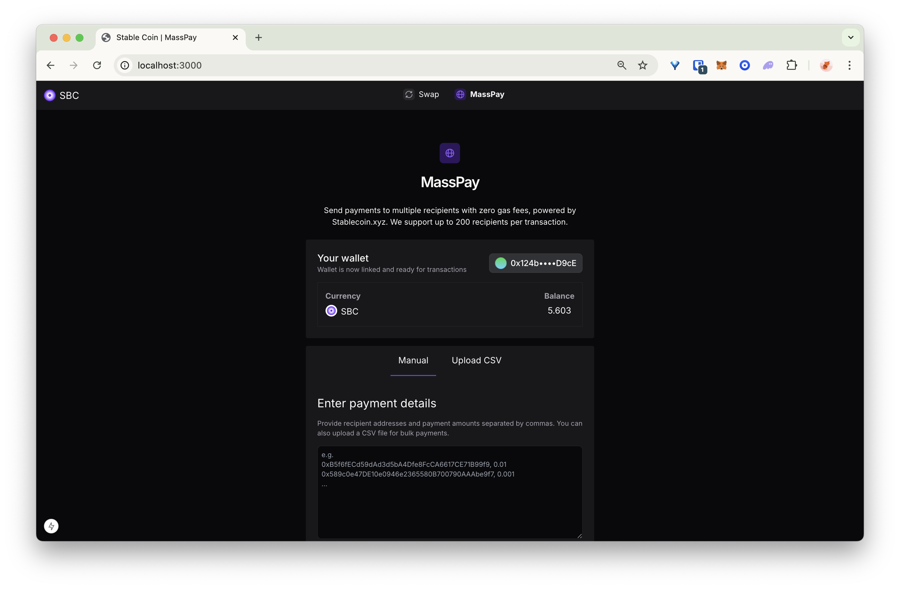

# masspay

This repo contains a utility allowing users to mass pay SBC (a ERC-20 stablecoin token) on the Base blockchain without having to pay for gas fees. It uses a custom signature verifying Paymaster to let qualifying users (e.g. holders of SBC) to send user operations without worrying about gas. This repo uses [WalletConnect](https://reown.com/) to connect to the user's wallet. The [ShadCN UI](https://ui.shadcn.com/) component library is used for buttons, dialogs, tables, and toasts.

## Demo

You can interact live right [here](https://masspay.stablecoin.xyz/). Both Base mainnet and Base Sepolia testnet are supported.

[](https://masspay.stablecoin.xyz/)

To get some SBC on Base, you can swap USDC for SBC using the [Gasless Swap](https://swap.stablecoin.xyz/) tool, which uses Uniswap V3 behind the scenes.

The SBC token is a multi-chain stablecoin pegged to the USD via Brale. The code for the SBC token smart contract can be found [here](https://basescan.org/token/0xfdcC3dd6671eaB0709A4C0f3F53De9a333d80798#code).

Once you have a SBC balance in your wallet, connect your wallet (top right corner). You can then input the recipient addresses and amounts to masspay via `Copy and Paste Mode` or `CSV Mode`. Each line is to follow the format `address,amount`. You can airdrop different amounts for different addresses if you wish.

For testing, you can use a [pre-generated csv file](./src/csv-samples/airdrop.100.csv) or use a tool like [Ethereum Wallet Generator](https://github.com/Planxnx/ethereum-wallet-generator) to generate a list of addresses.

Currently, the project is set up to airdrop SBC tokens to 200 addresses at a time.

## Environment Variables

To run this project locally, you will need to add the following environment variables to your .env file.

This early version of MassPay was built using Pimlico's paymaster service. We are happy to provide API credentials for you to install MassPay and test locally. Please connect with us on our SBC Telegram group: [@stablecoin_xyz](https://t.me/stablecoin_xyz). Pimlico also provides a free tier if you prefer to sign up for your own account.

## Run locally

Install dependencies

```bash
npm install
```

Start your development server after setting up the environment variables.

```bash
cp .env.example .env
npm run dev
```

## Connect with us

For any questions, reach out on [X](https://x.com/stablecoin_xyz) and Telegram [Telegram](https://t.me/stablecoin_xyz). Let us know if you have any feature requests for future versions.

## Author

- [@Ectsang](https://www.github.com/Ectsang)
